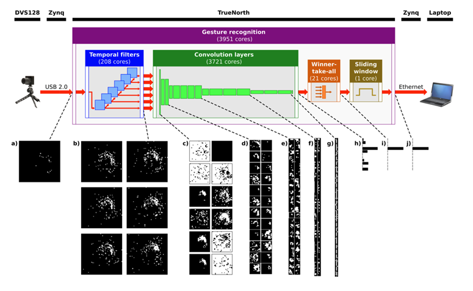

# Low-Power Event Based Gesture Recognition
Using the IBM DVS128 Dataset to train a CNN-RNN Model

### Abstract
This project aims to utilize a simulated low-power even-based image sensor as an input to a CNN-RNN (Convolutional Neural Network – Recurrent Neural Network). The system will draw inspiration from IBMs work using a Dynamic Vision Sensor (DVS) camera and TrueNorths neurosynaptic sensor [1]. While the IBM system expresses its efforts as a low energy implementation, it uses a processor and sensor that this project does not have access to. With that in mind, the project’s current scope is not to generate predictions for real-time data, rather preprocessed videos. The architecture of the network will utilize both CNN for spatial pattern recognition and RNN for temporal pattern recognition. Furthermore, to test the results of the IBM paper, the system will follow a similar network architecture as in the paper for the gesture recognition [Fig 1]. The project will train on IBMs DVS128 Gesture Dataset which contains 11 unique gestures [2].

### References
[1] A Low Power, Fully Event-Based Gesture Recognition System (thecvf.com)

[2] DVS128 Gesture Dataset - IBM Research

### Figures
[1] From IBM Paper in Ref. [1]

